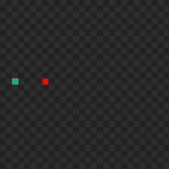

<h1 align="center">SnakePlusPlus</h1>
<h3 align="center">A basic console app snake game made in C++.</h3>

  
  
  

  

## Features

* Snake movement using WASD
* Random apple spawning.
* Death checks.
* Score printed after death.

  
  
  

